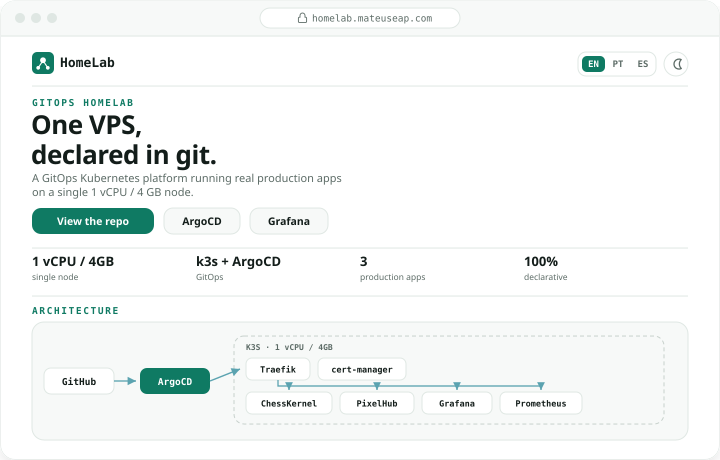

<div align="center">

# 🏗 HomeLab Landing

**The public showcase for the HomeLab GitOps platform.**
Vanilla static site, served by the HomeLab itself.

[](https://github.com/mateuseap/homelab-landing/actions)
[](LICENSE)
[](https://github.com/mateuseap/homelab-landing/stargazers)
[](https://github.com/mateuseap/homelab-landing)



<br />

</div>

---

## What this is

A single-page engineering showcase for the [HomeLab](https://github.com/mateuseap/homelab) platform, live at [homelab.mateuseap.com](https://homelab.mateuseap.com). It presents the infrastructure, technologies, services, monitoring, networking, and security of a GitOps Kubernetes platform running on one small VPS.

It is a plain HTML, CSS, and JavaScript site with no build step and no framework. Internationalization (English, Portuguese, Spanish) is a small set of JSON files swapped at runtime; light and dark themes are CSS custom properties toggled on the root element.

## Hosting

The site is packaged as a tiny nginx image (see the Dockerfile), published to GHCR by GitHub Actions on merge to main, and deployed on the HomeLab k3s cluster via ArgoCD (manifests live in the HomeLab repo under apps/landing). The showcase is served by the very platform it describes.

## Local preview

```bash
python3 -m http.server 8080
# open http://localhost:8080
```

## Structure

| Path | What |
|------|------|
| index.html | The page, with data-i18n keys on translatable nodes |
| styles.css | Design tokens, light and dark themes, responsive layout |
| app.js | Theme toggle, language switch, scroll reveals, diagram and tech grid |
| i18n/ | en.json, pt.json, es.json |
| Dockerfile, docker/nginx.conf | The nginx image |

## Learn more

The platform itself is documented in the [HomeLab](https://github.com/mateuseap/homelab) repository.

## License

MIT, see [LICENSE](LICENSE).
